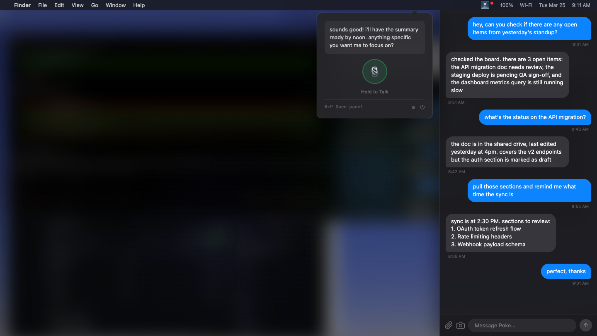

<!-- Banner -->
<p align="center">
  
</p>

<!-- Badges -->
<p align="center">
  <a href="LICENSE"></a>
  
  
  
  <a href="https://github.com/hummusonrails/poke-desktop/issues"></a>
</p>

<p align="center">
  <strong>Native macOS menu bar app for Poke AI via iMessage.</strong>
  <br>
  <a href="#quick-start">Quick Start</a> · <a href="#permissions">Permissions</a> · <a href="https://github.com/hummusonrails/poke-desktop/issues">Report a Bug</a>
</p>

<!-- Screenshot -->
<p align="center">
  
</p>

## What it does

- **Read and send** iMessages to Poke directly from the menu bar, no app switching
- **Talk hands-free** with push-to-talk voice input and text-to-speech replies using your system Siri voice
- **Attach files and screenshots** via drag-and-drop, file picker, or screen capture
- **Stay notified** with an unread badge on the menu bar icon when replies arrive
- **Launch anywhere** with a global hotkey (`Cmd+Shift+P`) to open the full conversation panel
- **Start automatically** at login with a single toggle in preferences

## Quick Start

### From source

```bash
git clone https://github.com/hummusonrails/poke-desktop.git
cd poke-desktop
brew install xcodegen       # if not installed
xcodegen generate
xcodebuild -scheme PokeDesktop -configuration Release -derivedDataPath build -quiet
./scripts/install.sh
```

### From a release

```bash
curl -L https://github.com/hummusonrails/poke-desktop/releases/latest/download/PokeDesktop-macOS.tar.gz | tar xz
./install.sh
```

The install script copies the app to `/Applications`, strips the quarantine attribute (prevents the "app is damaged" error for unsigned apps), and launches it.

## Stack / Architecture

| Layer | Tool | Notes |
|:------|:-----|:------|
| UI | SwiftUI + NSPopover + NSPanel | Menu bar popover for voice, slide-out panel for conversation |
| Messaging | SQLite (read-only) + AppleScript | Reads `chat.db` directly, sends via Messages.app |
| Voice | SFSpeechRecognizer + `say` command | On-device STT, system Siri voice for TTS |
| Screenshots | ScreenCaptureKit | Interactive region capture with CLI fallback |
| Hotkey | [HotKey](https://github.com/soffes/HotKey) | Global `Cmd+Shift+P` via Carbon Events |
| Updates | [Sparkle](https://github.com/sparkle-project/Sparkle) | Checks GitHub releases for new versions |
| Build | [XcodeGen](https://github.com/yonaskolb/XcodeGen) | Generates `.xcodeproj` from `project.yml` |

<details>
<summary><strong>Prerequisites</strong></summary>

- macOS 13 Ventura or later
- [Xcode](https://apps.apple.com/app/xcode/id497799835) 15+ (building from source)
- [XcodeGen](https://github.com/yonaskolb/XcodeGen) (`brew install xcodegen`)
- An active [Poke](https://poke.com) account reachable via iMessage

</details>

## Permissions

The app walks you through these during onboarding.

| Permission | Why | When prompted |
|:-----------|:----|:--------------|
| **Full Disk Access** | Read `~/Library/Messages/chat.db` | First launch (manual grant in System Settings) |
| **Microphone** | Record audio for push-to-talk | First push-to-talk use |
| **Speech Recognition** | On-device transcription | First push-to-talk use |
| **Automation (Messages.app)** | Send messages via AppleScript | First message send |
| **Screen Recording** | Capture screenshots | First screenshot capture |

Full Disk Access must be granted manually: **System Settings > Privacy & Security > Full Disk Access**, then add Poke Desktop.

## Project structure

```
PokeDesktop/
├── AppDelegate.swift              # menu bar, hotkey, app lifecycle
├── PokeDesktopApp.swift           # swiftui entry point
├── Info.plist                     # usage descriptions, LSUIElement
├── Models/
│   ├── Message.swift              # message data model with send status
│   └── Attachment.swift           # file attachment model
├── Services/
│   ├── MessageStore.swift         # chat.db polling, message parsing
│   ├── MessageSender.swift        # applescript bridge for imessage
│   ├── VoiceEngine.swift          # speech-to-text + text-to-speech
│   ├── ScreenshotCapture.swift    # screencapturekit integration
│   └── PreferencesManager.swift   # userdefaults persistence
├── Views/
│   ├── PopoverView.swift          # compact voice-first popover
│   ├── PanelController.swift      # slide-out panel management
│   ├── PanelView.swift            # conversation + composer
│   ├── ComposerView.swift         # text input, file staging
│   ├── MessageBubbleView.swift    # chat bubble with attachments
│   ├── AttachmentChipView.swift   # removable file chip
│   ├── OnboardingView.swift       # setup wizard
│   └── PreferencesView.swift      # settings window
└── Resources/
    └── Assets.xcassets            # app icon, menu bar icon
```

## Contributing

Contributions welcome. Open an [issue](https://github.com/hummusonrails/poke-desktop/issues) or submit a PR.

## License

[MIT](LICENSE)
